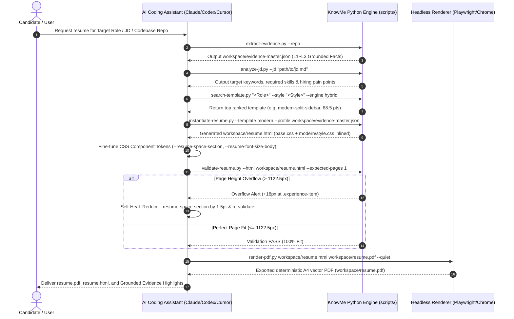

# KnowMe CareerForge — System Architecture & Design Specification

> **Positioning**: An agent-native skill for candidate self-discovery, career positioning, and tailored resume engineering across mainstream AI coding assistants (Claude Code, Codex, Cursor, Windsurf, Gemini CLI, Copilot, OpenCode).
>
> **Core Paradigms**: Evidence-First (L1~L3) · HTML Intermediate Working Canvas · Two-Tier Design Tokens · Pluggable Hybrid Search · Deterministic PDF Closed-Loop

---

## 1. The 4-Tier Documentation Pyramid

KnowMe CareerForge adopts a progressive 4-tier documentation architecture to ensure clean separation of concerns between agent execution, developer maintenance, architectural governance, and runtime rules:

```
┌────────────────────────────────────────────────────────────────────────────────────────┐
│                        KnowMe CareerForge 4-Tier Documentation Pyramid                 │
├────────────────────────────────────────────────────────────────────────────────────────┤
│ L0: Platform Distribution │ SKILL.md (Agent 6-Stage Reasoning Contract) + skill.json   │
├───────────────────────────┼────────────────────────────────────────────────────────────┤
│ L1: Agent & Dev Contracts │ CLAUDE.md (Developer Command Cheat Sheet & Guidelines)     │
│                           │ AGENT.md (Vercel-inspired Agent Editorial Standards & Spec)│
├───────────────────────────┼────────────────────────────────────────────────────────────┤
│ L2: Architecture & ADRs   │ ARCHITECTURE.md (6-Tier Architecture, Seams, Data Flow)    │
│                           │ docs/decisions/ (Architecture Decision Records - ADRs)     │
├───────────────────────────┼────────────────────────────────────────────────────────────┤
│ L3: Runtime Domain Assets │ references/ (01-evidence-mining.md ~ 06-qa-and-rendering)  │
│ (Source of Truth)         │ src/templates/ (common/base.css + template style.css)      │
│                           │ src/knowledge/ (roles/*.json, layouts.json, styles.json)   │
└────────────────────────────────────────────────────────────────────────────────────────┘
```

---

## 2. Six-Layer System Architecture

```
┌─────────────────────────────────────────────────────────────────────────────┐
│ 1. Multi-Agent Ecosystem Layer (Distribution & Adapters)                    │
│    Claude Code | Codex | Cursor (.mdc) | Windsurf | Gemini CLI | OpenCode   │
└──────────────────────────────────────┬──────────────────────────────────────┘
                                       │ CLI Dynamic Config Injection
┌──────────────────────────────────────▼──────────────────────────────────────┐
│ 2. Skill Execution Core Layer (Agent Reasoning Contract)                     │
│    SKILL.md (6-Stage Pipeline) │ AGENT.md (Quiet Execution & Editorial Gate)│
└──────────────────────────────────────┬──────────────────────────────────────┘
                                       │ Python Toolchain / CLI Invocation
┌──────────────────────────────────────▼──────────────────────────────────────┐
│ 3. Retrieval & Reasoning Engine Layer (Deep Modules in scripts/)            │
│    search-template.py (Hybrid/BM25) │ instantiate-resume.py (CSS Inlining)   │
│    extract-evidence.py (L1~L3 Miner)│ analyze-jd.py (Signal & Keyword Parser)│
└──────────────────────────────────────┬──────────────────────────────────────┘
                                       │ Structured Schema Data
┌──────────────────────────────────────▼──────────────────────────────────────┐
│ 4. Structured Knowledge & Data Assets Layer (src/knowledge/ - SSoT)         │
│    roles/*.json (9+ Role Profiles)  │ layouts.json │ styles.json            │
│    resume-schema.json (Master Schema)│ ats-rules.json                        │
└──────────────────────────────────────┬──────────────────────────────────────┘
                                       │ Instantiation into Intermediate Canvas
┌──────────────────────────────────────▼──────────────────────────────────────┐
│ 5. HTML Resume Template & Token Engine Layer (src/templates/)               │
│    common/base.css (Primitives & A4 Print) │ minimal/ │ modern/ │ classic/  │
│    executive/ │ CSS Variables Two-Tier Hierarchy (--primitive-* / --resume-*)│
└──────────────────────────────────────┬──────────────────────────────────────┘
                                       │ Dual QA & Headless Browser Rendering
┌──────────────────────────────────────▼──────────────────────────────────────┐
│ 6. Rendering & Automated QA Closed-Loop Layer                                │
│    validate-resume.py (Layout Box Fit) │ validate-ats.ts (Text Stream QA)   │
│    render-pdf.py (Deterministic Playwright / Chrome Multi-Engine Export)    │
└─────────────────────────────────────────────────────────────────────────────┘
```

---

## 3. End-to-End Deterministic Data Flow



---

## 4. Deep Module Seams & Interface Specifications

Following the **Codebase Design (Deep Modules)** philosophy, complex logic is encapsulated behind minimal, robust seams:

### 4.1 Search Engine Seam (`scripts/template/search-template.py`)
- **Interface**: `search_templates(role, style=None, target_pages=1, density="balanced", keywords=None, engine="hybrid") -> List[Dict]`
- **Implementation**: Pluggable `BaseTemplateScorer` hierarchy (`WeightedRuleScorer`, `BM25TextScorer`, `HybridTemplateScorer`).
- **Leverage**: Callers pass high-level query parameters; tokenization, BM25 TF-IDF computation, and multi-criteria scoring are fully hidden behind the seam.

### 4.2 Workspace Canvas Instantiator Seam (`scripts/template/instantiate-resume.py`)
- **Interface**: `instantiate_workspace(template_id, profile_path=None, keywords=None, output_path="workspace/resume.html") -> Path`
- **Implementation**: Automatic asset resolution, merging `common/base.css` + `templates/{id}/style.css`, single-file inlining, and profile schema injection.
- **Invariants**: `workspace/resume.html` is strictly self-contained with zero runtime dependencies.

---

## 5. Two-Tier Design Tokens Architecture

To enable instant theme inheritance, zero code duplication, and deterministic agent self-healing, CSS variables are organized into two layers:

```css
/* === Layer 1: Primitive Tokens (common/base.css) === */
:root {
  --primitive-color-slate-900: #0f172a;
  --primitive-color-blue-600:  #2563eb;
  --primitive-space-1: 2pt;
  --primitive-space-2: 4pt;
  --primitive-space-4: 8pt;
  --primitive-space-6: 12pt;
  --primitive-font-sans: -apple-system, BlinkMacSystemFont, "Segoe UI", "PingFang SC", sans-serif;
  --primitive-page-width: 210mm;
  --primitive-page-min-height: 297mm;
}

/* === Layer 2: Component Tokens (template style.css) === */
:root {
  --resume-color-primary: var(--primitive-color-slate-900);
  --resume-color-accent: var(--primitive-color-blue-600);
  --resume-space-section: var(--primitive-space-6);
  --resume-space-item: var(--primitive-space-4);
  --resume-font-size-body: var(--primitive-font-size-body);
}
```

---

## 6. Architecture Decision Records (ADRs)

Key architectural choices are formally documented in `docs/decisions/`:

1. [ADR-0001: HTML as Sole Intermediate Working Canvas](docs/decisions/0001-html-intermediate-canvas.md)
2. [ADR-0002: Pure CSS3 Design Tokens over Tailwind Runtime](docs/decisions/0002-pure-css-design-tokens-over-tailwind.md)
3. [ADR-0003: Two-Tier Token Architecture (Primitives + Components)](docs/decisions/0003-two-tier-tokens-architecture.md)
4. [ADR-0004: Decentralized JSON Metadata with Build-Time BM25 Index](docs/decisions/0004-decentralized-json-with-bm25-index.md)
