# KnowMe CareerForge

> **Know Yourself. Define Your Direction. Forge Your Opportunity.**
>
> *An agent-native skill for self-discovery, career positioning, and tailored resume engineering.*

---

[English](README.md) | [中文说明](README.zh-CN.md)

[](LICENSE)
[](skill.json)
[](SKILL.md)

---

## 1. What is KnowMe CareerForge?

**KnowMe CareerForge** is not just another generic AI resume generator.

Traditional AI resume tools treat resume writing as a superficial text-generation task: feed a prompt to an LLM, get a block of Markdown, and convert it through external converters into a fragile, hallucination-prone PDF.

**KnowMe CareerForge** fundamentally rethinks this paradigm into a structured, dual-engine system:

```text
knowme-careerforge-skill
          │
          ▼
   KnowMe CareerForge
          │
    ┌─────┴─────┐
    ▼           ▼
  KnowMe     CareerForge
    │           │
Self Discovery  Tailored Career Story
& Evidence      & Engineering Delivery
```

- **KnowMe (Self-Discovery & Evidence Engine)**: Helps candidates discover who they are, uncover their verifiable career evidence (L1~L3), and map their true competitive strengths.
- **CareerForge (Career Positioning & Resume Engineering)**: Translates genuine strengths into targeted positioning for specific job opportunities, tailoring high-impact content inside an **HTML Intermediate Working Canvas** with **Design Tokens**, and delivering deterministic, pixel-perfect PDFs via Playwright.

---

## 2. Core Philosophy & Guiding Principle

> ### *"The goal is not to make the candidate look better than they are. The goal is to make their real strengths visible to the right opportunity."*

```text
WRONG DIRECTION (Generic AI Hallucination):
JD ──> Keyword Stuffing ──> AI Guessing ──> Superficial Fluff ──> Inflated Claims (Fragile in Interviews)

RIGHT DIRECTION (KnowMe CareerForge):
Real Experience ──> Grounded Evidence ──> True Strengths ──> Job Match ──> Precise Engineering & Narrative
```

---

## 3. The 3 Operational Modes

KnowMe CareerForge seamlessly adapts to candidate inputs across 3 primary scenarios:

```text
┌─────────────────────────────────────────────────────────────────────────────┐
│ Mode A: Target-Role Mode                                                    │
│ User specifies a career direction (e.g., "Senior AI Agent Engineer").       │
│ ▶ Agent loads role skill tree, extracts matching evidence, builds variant.  │
├─────────────────────────────────────────────────────────────────────────────┤
│ Mode B: JD-Specific Mode                                                    │
│ User pastes a concrete Job Description (JD).                                │
│ ▶ Agent runs analyze-jd.py, performs gap analysis, highlights hiring keys.  │
├─────────────────────────────────────────────────────────────────────────────┤
│ Mode C: Repo-to-Resume Mode                                                 │
│ User supplies a GitHub repository / codebase / project notes.               │
│ ▶ Agent inspects code/config files, grades evidence into L1~L3, builds FAB. │
└─────────────────────────────────────────────────────────────────────────────┘
```

---

## 4. End-to-End Skill Usage Walkthrough (Step-by-Step)

Here is the exact step-by-step execution path when activating KnowMe CareerForge in an AI Agent:

```mermaid
sequenceDiagram
    autonumber
    actor User as Candidate
    participant Agent as AI Agent (Claude/Codex/Cursor)
    participant Engine as KnowMe Scripts (Python/TS)
    participant Chrome as Playwright (Chromium QA)

    User->>Agent: "Tailor my resume for this Senior AI Engineer JD: [paste JD + experience]"
    
    rect rgb(30, 41, 59)
    note right of Agent: Stage 1 & 2: Know Me & Define
    Agent->>Engine: Run scripts/analyze-jd.py on JD text
    Engine-->>Agent: Returns Must-Have Skills, Signals, and Seniority
    Agent->>Agent: Classifies candidate facts into L1 (Code), L2 (Module), L3 (Context)
    end

    rect rgb(15, 23, 42)
    note right of Agent: Stage 3 & 4: Position & Strategy
    Agent->>Agent: Formulates Core Value Proposition & Section Priority
    Agent->>Engine: Run scripts/search-template.py "AI Agent Engineer" --style "two-column-split"
    Engine-->>Agent: Recommends template (e.g., modern, score 89.0)
    end

    rect rgb(30, 58, 138)
    note right of Agent: Stage 5: CareerForge Canvas Instantiation
    Agent->>Engine: Run scripts/instantiate-resume.py --template modern --keywords "Python,LLM,RAG"
    Engine-->>Agent: Creates self-contained workspace/resume.html
    Agent->>Agent: Populates experience using FAB formula & calibrates CSS variables
    end

    rect rgb(20, 83, 45)
    note right of Agent: Stage 6: Dual QA & Deterministic Export
    Agent->>Engine: Run scripts/validate-resume.py & scripts/validate-layout.ts
    alt DOM Height Exceeds A4 (1122.5px)
        Engine-->>Agent: Overflow Alert (e.g. Height 1145px > 1122.5px by 22.5px)
        Agent->>Agent: Self-heals: reduces --resume-space-section & --resume-font-size-body
        Agent->>Engine: Re-validates (Pass)
    end
    Agent->>Chrome: Run npx ts-node scripts/render-pdf.ts
    Chrome-->>Agent: Generates workspace/resume.pdf
    end

    Agent-->>User: Delivers workspace/resume.html + workspace/resume.pdf + Evidence Report
```



---

## 5. Token Self-Healing & Visual Tuning Cheat Sheet

All visual parameters are concentrated in `:root` variables inside `workspace/resume.html`. Agent and candidates can adjust these tokens for instant global self-healing:

| CSS Token | Default | Compact (1-Page Squeeze) | Relaxed (2-Page Flow) | Purpose |
| :--- | :--- | :--- | :--- | :--- |
| `--resume-space-section` | `12pt` | `9.5pt` ~ `10.5pt` | `14pt` ~ `16pt` | Section vertical gap (primary self-healing knob) |
| `--resume-space-item` | `8pt` | `6.5pt` ~ `7pt` | `9pt` ~ `11pt` | Item gap between jobs/projects |
| `--resume-font-size-body` | `9.2pt` | `8.8pt` ~ `9.0pt` | `9.5pt` ~ `10pt` | Body text size (safe legibility floor is 8.8pt) |
| `--resume-line-height-body` | `1.45` | `1.38` | `1.50` | Line height ratio |
| `--resume-color-accent` | `#2563eb` | Custom Hex | Custom Hex | Primary theme accent color |
| `--resume-sidebar-width` | `32%` | `30%` | `35%` | Sidebar width (for modern/executive templates) |

---

## 6. Installation & Multi-Platform CLI Commands

```bash
# 0. Clone repository
git clone https://github.com/Max-Samson/knowme-careerforge-skill.git
cd knowme-careerforge-skill
npm install

# 1. Install Skill for your favorite AI Agent
npx ts-node cli/src/index.ts init --ai cursor
npx ts-node cli/src/index.ts init --ai claude
npx ts-node cli/src/index.ts init --ai codex
npx ts-node cli/src/index.ts init --all

# 2. List all available roles, templates, and layouts
npx ts-node cli/src/index.ts list

# 3. Search best template for target role
python3 scripts/search-template.py "Senior Frontend Architect" --style "single-column" --target-pages 1

# 4. Analyze a target Job Description
python3 scripts/analyze-jd.py --jd examples/ai-engineer/jd.md

# 5. Instantiate Intermediate Canvas with keyword highlights
python3 scripts/instantiate-resume.py --template modern --keywords "Python,LLM,RAG,FastAPI" --output workspace/resume.html

# 6. Run automated structural and density validation
python3 scripts/validate-resume.py --html workspace/resume.html --expected-pages 1

# 7. Render deterministic pixel-perfect PDF via Playwright
npx ts-node scripts/render-pdf.ts --input workspace/resume.html --output workspace/resume.pdf

# 8. Build static HTML Template Gallery
python3 scripts/build-gallery.py
```

---

## 7. Core Templates Showcase

| Template ID | Style | Category | ATS Tier | Best For | Target Pages |
| :--- | :--- | :--- | :--- | :--- | :--- |
| **`minimal`** | Single-Column Minimal | Tech / AI | Tier 1 (Optimal) | Backend, Algorithms, AI Research, Systems | 1 Page |
| **`modern`** | Two-Column Split (32:68) | Tech / Fullstack | Tier 1 (Optimal) | Fullstack, AI Agent, Frontend, Global Roles | 1~2 Pages |
| **`executive`** | Executive Banner + 33:67 | Leadership / Product | Tier 1 (Optimal) | Tech Director, Chief Architect, Tech Lead | 1~2 Pages |
| **`classic`** | Structured Table Grid | Corporate / Gov | Tier 1 (Optimal) | State Enterprises, Finance, Hardware, Civil | 1 Page |

---

## 8. Test Suites & Verification

The repository includes a full-chain automated test suite:

```bash
# Run all Python & TypeScript test suites
python3 scripts/run-all-tests.py

# Or run via unittest discovery
python3 -m unittest discover -s tests
```

---

## 9. License

This project is licensed under the **MIT License** - see the [LICENSE](LICENSE) file for details.
