# KnowMe CareerForge

> **认识自己，明确方向，锻造属于你的职业机会。**
>
> *Know Yourself. Define Your Direction. Forge Your Opportunity.*
>
> *面向主流 AI Agent 的自我认知、职业定位与岗位定制简历工程 Skill。*

---

[中文说明](README.zh-CN.md) | [English Documentation](README.md)

[](LICENSE)
[](skill.json)
[](SKILL.md)

---

## 1. 什么是 KnowMe CareerForge？

**KnowMe CareerForge** 绝非又一个普通的“AI 简历代写生成器”。

传统的 AI 简历工具通常将写简历视为简单的“文本生成任务”：给大模型一段提示词，吐出一堆 Markdown，再经由黑盒转换器输出格式混乱、排版错位、充斥幻觉的 PDF。

**KnowMe CareerForge** 从底层重构了这一范式，打造为结构化的**双引擎协作系统**：

```text
knowme-careerforge-skill
          │
          ▼
   KnowMe CareerForge
          │
    ┌─────┴─────┐
    ▼           ▼
  KnowMe     CareerForge
    │           │
认识自己       锻造职业表达
真实经历与证据   工程化定制交付
```

- **KnowMe（自我认知与证据挖掘引擎）**：帮助候选人深入认知自我，系统梳理真实经历与可验证的代码/项目证据（L1~L3 分级），提炼真正具备竞争壁垒的优势点。
- **CareerForge（职业定位与简历工程引擎）**：将候选人的真实优势精准对齐目标岗位（JD），以 **HTML 中间工作区（Intermediate Canvas）** 与 **Design Tokens（设计系统变量）** 为工作场进行微调排版，最终通过 Playwright 无头浏览器导出确定性、像素级的矢量 PDF。

---

## 2. 核心价值观与设计原则

> ### *"目标不是让候选人看起来比真实情况更优秀，而是让真实的优势被正确的机会看见。"*
>
> *(The goal is not to make the candidate look better than they are. The goal is to make their real strengths visible to the right opportunity.)*

```text
【错误方向 (传统 AI 盲目夸大与幻觉)】
目标 JD ──> 提取关键词 ──> AI 凭空猜测 ──> 虚假包装 ──> 夸大造假 (面试必露馅)

【正确方向 (KnowMe CareerForge 证据为先)】
真实经历 ──> 代码/事实证据 ──> 核心优势 ──> 岗位精准匹配 ──> 高质量职业叙事与工程交付
```

---

## 3. 三大运行模式 (Operational Modes)

```text
┌─────────────────────────────────────────────────────────────────────────────┐
│ 模式 A：目标岗位模式 (Target-Role Mode)                                       │
│ 用户指定职业发展方向（如“资深 AI Agent 研发工程师”）。                       │
│ ▶ Agent 加载岗位能力树，从经历库中提取强匹配证据，派生对应 Resume Variant。  │
├─────────────────────────────────────────────────────────────────────────────┤
│ 模式 B：具体 JD 定制模式 (JD-Specific Mode)                                 │
│ 用户粘贴具体的招聘需求 (Job Description)。                                   │
│ ▶ Agent 运行 analyze-jd.py 执行差距分析，提取加分项并高亮核心招聘信号。     │
├─────────────────────────────────────────────────────────────────────────────┤
│ 模式 C：代码库到经历挖掘模式 (Repo-to-Resume Mode)                           │
│ 用户提供 GitHub 仓库链接、代码目录或工程笔记。                              │
│ ▶ Agent 审查源码与配置文件，判定 L1~L3 证据等级，重塑为高质量 FAB 论据。    │
└─────────────────────────────────────────────────────────────────────────────┘
```

---

## 4. 端到端 Skill 完整执行链路 (Step-by-Step)

在 AI Agent（Claude Code、Codex、Cursor、Windsurf、Gemini 等）中激活本 Skill 后的标准闭环工作流如下：

```mermaid
sequenceDiagram
    autonumber
    actor User as 求职候选人
    participant Agent as AI Agent (Claude/Cursor/Codex)
    participant Engine as KnowMe 工具链 (Python/TS)
    participant Chrome as Playwright (Chromium 无头浏览器)

    User->>Agent: “帮我针对这份资深 AI 工程师 JD 定制一份简历：[粘贴 JD + 个人经历]”
    
    rect rgb(30, 41, 59)
    note right of Agent: 阶段 1 & 2: 认知与定位 (Know & Define)
    Agent->>Engine: 运行 scripts/analyze-jd.py 分析目标 JD
    Engine-->>Agent: 输出必备技能 (Must-Have)、加分项与招聘信号
    Agent->>Agent: 梳理经历，执行 L1(代码)、L2(模块)、L3(推论) 证据分级
    end

    rect rgb(15, 23, 42)
    note right of Agent: 阶段 3 & 4: 策略与选模 (Understand & Position)
    Agent->>Agent: 提炼核心价值主张 (CVP) 并规划模块优先级 (Skills 优先)
    Agent->>Engine: 运行 scripts/search-template.py "AI Agent Engineer" --style "two-column-split"
    Engine-->>Agent: 智能推荐最佳模板 (如 modern 模板，匹配度 89.0 分)
    end

    rect rgb(30, 58, 138)
    note right of Agent: 阶段 5: 简历工程与工作区实例化 (CareerForge)
    Agent->>Engine: 运行 scripts/instantiate-resume.py --template modern --keywords "Python,LLM,RAG"
    Engine-->>Agent: 组装生成单文件自包含修改场 workspace/resume.html
    Agent->>Agent: 运用 FAB 模型重塑 Bullets，注入关键词高亮，调校 CSS 变量
    end

    rect rgb(20, 83, 45)
    note right of Agent: 阶段 6: 双重质检与确定性渲染 (Review & Dual QA)
    Agent->>Engine: 运行 scripts/validate-resume.py 与 scripts/validate-layout.ts
    alt 检测到页面高度溢出 A4 边界 (如 1145px > 1122.5px 超出 22.5px)
        Engine-->>Agent: 反馈溢出节点与具体超标像素
        Agent->>Agent: 自愈调优：在 <style> 中微调 --resume-space-section 与字号
        Agent->>Engine: 再次运行质检 (100% 通过)
    end
    Agent->>Chrome: 运行 npx ts-node scripts/render-pdf.ts
    Chrome-->>Agent: 确定性导出 workspace/resume.pdf
    end

    Agent-->>User: 交付 workspace/resume.html + workspace/resume.pdf + 证据链映射报告
```



---

## 5. CSS Design Tokens 调优与自愈速查表

所有模板排版参数均集中在 `workspace/resume.html` 的 `:root` 变量中，Agent 与候选人可通过微调以下变量实现全局秒级调优与溢出自愈：

| CSS Token 变量名 | 默认推荐值 | 紧凑模式 (单页压测微调) | 宽松模式 (两页饱满) | 调优核心作用 |
| :--- | :--- | :--- | :--- | :--- |
| `--resume-space-section` | `12pt` | `9.5pt` ~ `10.5pt` | `14pt` ~ `16pt` | 模块间纵向间距 (自愈主要调节旋钮) |
| `--resume-space-item` | `8pt` | `6.5pt` ~ `7pt` | `9pt` ~ `11pt` | 经历/项目条目间距 |
| `--resume-font-size-body` | `9.2pt` | `8.8pt` ~ `9.0pt` | `9.5pt` ~ `10pt` | 正文字号 (物理可读性安全底线为 8.8pt) |
| `--resume-line-height-body`| `1.45` | `1.38` | `1.50` | 正文行高比例 |
| `--resume-color-accent` | `#2563eb` | 自定义 Hex 色值 | 自定义 Hex 色值 | 主题强调色 (科技蓝/松石绿/经典深蓝) |
| `--resume-sidebar-width` | `32%` | `30%` | `35%` | 侧边栏占比 (双栏/高管模板有效) |

## 6. 安装与多平台 CLI 命令总览

```bash
# 0. 克隆项目仓库
git clone https://github.com/Max-Samson/knowme-careerforge-skill.git
cd knowme-careerforge-skill
npm install

# 1. 为主流 AI Agent 平台一键初始化配置
npx ts-node cli/src/index.ts init --ai cursor
npx ts-node cli/src/index.ts init --ai claude
npx ts-node cli/src/index.ts init --ai codex
npx ts-node cli/src/index.ts init --all

# 2. 列出本地知识库所有可用岗位与核心模板
npx ts-node cli/src/index.ts list

# 3. 智能检索最匹配的 HTML 简历模板
python3 scripts/search-template.py "资深前端架构师" --style "single-column" --target-pages 1

# 4. 深度解析目标 JD 文本与技能词频
python3 scripts/analyze-jd.py --jd examples/ai-engineer/jd.md

# 5. 实例化 HTML 中间工作区并注入关键词高亮
python3 scripts/instantiate-resume.py --template modern --keywords "Python,LLM,RAG,FastAPI" --output workspace/resume.html

# 6. 运行布局结构、Design Tokens 与文字密度验证
python3 scripts/validate-resume.py --html workspace/resume.html --expected-pages 1

# 7. 通过 Playwright 确定性导出无损矢量 A4 PDF
npx ts-node scripts/render-pdf.ts --input workspace/resume.html --output workspace/resume.pdf

# 8. 重新编译静态模板画廊
python3 scripts/build-gallery.py
```

---

## 7. 首期 4 款黄金基准模板

| 模板 ID | 版式风格 | 岗位分类 | ATS 评级 | 适用人群与设计特质 | 目标页数 |
| :--- | :--- | :--- | :--- | :--- | :--- |
| **`minimal`** | 单栏极简线性流 | 研发 / AI | Tier 1 (极佳) | 后端、算法、系统、AI 工程师；强调技术胶囊与代码证据 | 1 页 |
| **`modern`** | 左右双栏 (32:68) | 研发 / 全栈 | Tier 1 (极佳) | 全栈、AI 应用、海外远程；深海蓝侧栏，视觉层次丰满 | 1~2 页 |
| **`executive`** | 墨黑顶栏 + 33:67 双栏 | 管理 / 产品 | Tier 1 (极佳) | 技术总监、首席架构师、Team Lead；突出领导力与重大项目 | 1~2 页 |
| **`classic`** | 现代结构化表格网格 | 综合 / 政企 | Tier 1 (极佳) | 国企、金融科技、政企合规岗位；6列矩阵，最高信息密度 | 1 页 |

---

## 8. 自动化测试与质量保障

项目内置全链路自动化测试套件：

```bash
# 运行全套 Python & TypeScript 测试脚本
python3 scripts/run-all-tests.py

# 或通过 unittest 自动发现测试
python3 -m unittest discover -s tests
```

---

## 9. 开源协议

本项目采用 **MIT 开源协议**，详情请参阅 [LICENSE](LICENSE) 文件。
