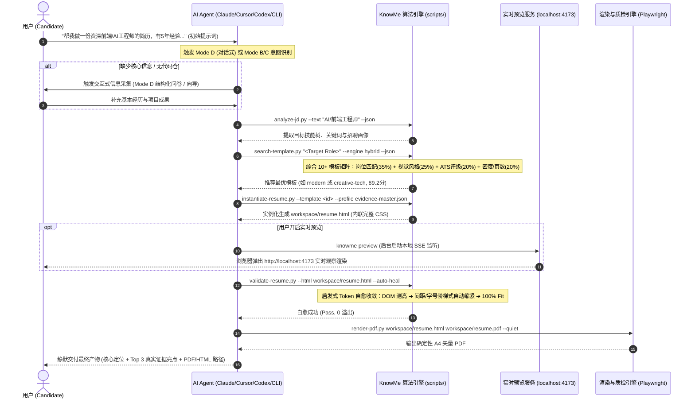
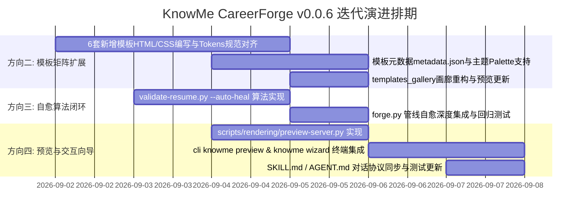

# KnowMe CareerForge — v0.0.6 迭代规划与工程设计规范 (PRD & Technical Spec)

> **版本定位**：面向全平台 AI Agent 与终端用户的 **端到端流畅使用体验闭环**、**模板矩阵扩展** 与 **算法驱动自动自愈**。  
> **核心演进方向**：方向二（模板矩阵与设计系统升级） · 方向三（启发式 `--auto-heal` 自愈质检闭环） · 方向四 1 & 2（本地实时预览与交互式建档向导）。  
> **制定日期**：2026-09-01  
> **标准对齐**：ADR-0001 ~ ADR-0006 · 4-Tier Documentation Pyramid  

---

## 1. 全景用户旅程与使用体验闭环 (End-to-End User Experience)

本迭代的核心目标是让用户使用 Skill 时，无论输入多么简略的提示词，系统均能**丝滑捕获意图 ➔ 渐进式引导补充 ➔ 算法智能选模 ➔ 自动装配画布 ➔ 算法自愈定稿 ➔ 本地实时预览 ➔ 确定性交付 PDF**。



---

## 2. 迭代功能模块与技术方案设计

### 2.1 【方向二】模板矩阵扩展与设计系统升级 (Template Matrix 2.0)

首期 4 套黄金基准模板（`minimal`, `modern`, `executive`, `classic`）已验证了单文件自包含 HTML 与 Design Tokens 架构。本阶段将扩展为 **10 套覆盖全职业场景的专业模板矩阵**，并升级调色板变量体系。

#### 1. 扩充的 6 套新增核心模板

| 模板 ID | 版式构图比例 | 视觉色调与调色板 | 目标人群与适用场景 | 目标页数 | 信息密度 | ATS 评级 |
| :--- | :--- | :--- | :--- | :--- | :--- | :--- |
| **`academic-research`** | 单栏紧凑学术风 | Oxford Navy (`#1e3a8a`) + Slate | 高校硕博、算法科学家、科研人员；强化论文列表、专利与开源引用 | 1~2 页 | 极高 (Ultra) | Tier 1 |
| **`international-flow`** | 欧美极简纯文字流 (无头像) | Neutral Slate (`#0f172a`) + Charcoal | 外企跨国求职、海外远程 (US/EU)；严格遵守海外反歧视法无头像排版 | 1~2 页 | 中等 (Balanced) | Tier 1 |
| **`creative-tech`** | 非对称双栏 (28:72) + 胶囊标签 | Tech Violet (`#7c3aed`) + Indigo | 前端专家、UI/UX 研发、创意技术岗；强调组件库、交互设计与产品体验 | 1 页 | 中等 (Balanced) | Tier 1 |
| **`compact-dense`** | 极致紧凑双列网格 | Steel Blue (`#0369a1`) + Dark Slate | 8~15 年资深工程师、全栈专家；在单页 A4 物理空间内容纳超高信息量 | 1 页 | 极高 (Ultra) | Tier 1 |
| **`startup-generalist`** | 模块化卡片流 | Emerald Green (`#059669`) + Slate | 早期初创公司 0~1 骨干、独立开发者；突出多面手能力与商业成果 | 1 页 | 高 (High) | Tier 1 |
| **`data-analyst`** | 指标驱动双栏 (30:70) | Amber Cyan (`#0891b2`) + Slate | 数据科学家、BI 专家、增长架构师；强化业务量化指标（ROI, DAU, GMV）看板 | 1 页 | 高 (High) | Tier 1 |

#### 2. 主题调色板预设引擎 (Palette Presets)
在 `src/templates/common/base.css` 中扩充 6 套官方主题调色板，支持通过 Component Token 一键无缝换色：
- `--palette-tech-blue`: 经典科技蓝 (`#2563eb`)
- `--palette-deep-navy`: 深邃海航蓝 (`#1e3a8a`)
- `--palette-teal-modern`: 现代松石绿 (`#0f766e`)
- `--palette-emerald-fresh`: 活力翡翠绿 (`#059669`)
- `--palette-violet-creative`: 创意极光紫 (`#7c3aed`)
- `--palette-slate-minimal`: 极简碳素灰 (`#334155`)

---

### 2.2 【方向三】启发式 Token 自动自愈算法 (`--auto-heal`)

针对简历内容长度不一导致的 DOM 物理高度溢出问题，在 `scripts/validation/validate-resume.py` 中内置基于启发式梯阶的自动调谐算法，彻底消除 Agent 多轮试错成本。

#### 1. 自愈调优算法执行阶梯 (The Auto-Healing Ladder)

```python
# 算法逻辑伪代码：
def auto_heal_resume(html_path: Path, max_pages: int = 1) -> bool:
    target_height = max_pages * 1122.5  # A4 96 DPI 标准高度
    current_height = measure_dom_height(html_path)
    
    if current_height <= target_height:
        return True  # 完美契合，无需调优
        
    # 阶段 1: 压缩模块间距 (Section Spacing)
    for space_sec in [10.5, 9.5, 8.5]:
        update_root_token(html_path, "--resume-space-section", f"{space_sec}pt")
        if measure_dom_height(html_path) <= target_height:
            return True
            
    # 阶段 2: 压缩条目与列表项间距 (Item & Bullet Spacing)
    for space_item, space_bullet in [(7.0, 2.5), (6.0, 2.0), (5.0, 1.5)]:
        update_root_token(html_path, "--resume-space-item", f"{space_item}pt")
        update_root_token(html_path, "--resume-space-bullet", f"{space_bullet}pt")
        if measure_dom_height(html_path) <= target_height:
            return True
            
    # 阶段 3: 微调字号与正文行高 (Typography Scale - 保持物理可读底线 >= 8.8pt)
    for font_size, line_height in [(9.0, 1.42), (8.8, 1.38)]:
        update_root_token(html_path, "--resume-font-size-body", f"{font_size}pt")
        update_root_token(html_path, "--resume-line-height-body", f"{line_height}")
        if measure_dom_height(html_path) <= target_height:
            return True

    # 阶段 4: 若仍溢出，计算具体超出的高度与节点选择器，输出精简文本指引
    delta_px = measure_dom_height(html_path) - target_height
    generate_content_condense_advisory(html_path, delta_px)
    return False
```

#### 2. 闭环质检与自愈命令标准
- CLI 独立调用：`knowme validate --html workspace/resume.html --auto-heal`
- 管线一键集成：`knowme forge --auto-heal` / `python3 scripts/pipeline/forge.py --auto-heal`

---

### 2.3 【方向四-1】零依赖本地实时热重载预览服务器 (`knowme preview`)

提供极简、无外部庞大依赖的即时 Web 预览服务，便于用户在生成或修改简历时通过浏览器即时查看效果。

#### 1. 架构设计
- **核心文件**：`scripts/rendering/preview-server.py` 与 `cli/src/commands/preview.ts`；
- **实现原理**：
  1. 基于 Python 标准库 `http.server` 启动本地轻量 HTTP Server（默认端口 `4173`，若被占用自动递增）；
  2. 监听 `workspace/resume.html` 的文件修改时间戳（mtime）；
  3. 服务端向响应流动态注入一段 25 行轻量 JavaScript 热重载脚本（基于 SSE `EventSource` 或每 300ms 心跳轮询）；
  4. 自动调用系统默认浏览器打开 `http://localhost:4173`；
  5. 当 Agent 或用户修改 `workspace/resume.html` 时，浏览器页面在 $<100\text{ms}$ 内无刷新或瞬时刷新。

---

### 2.4 【方向四-2】Mode D 对话式建档向导与初次交互流程优化 (Interactive Wizard)

当用户通过自然语言进入 Skill（例如输入：*“帮我写一份资深前端工程师简历，我有 5 年经验”*），系统提供优雅的渐进式问卷与交互建档向导。

#### 1. 渐进式 3 轮建档协议 (Progressive 3-Turn Intake)
- **Turn 1 (身份与意向)**：确认候选人姓名、联系方式、所在城市及目标岗位/求职意向；
- **Turn 2 (工作与主干经历)**：收集近 2~3 段工作经历（公司、职位、时间、负责领域）；
- **Turn 3 (核心项目与亮点数据)**：引导输入 2~3 个代表性项目及量化交付成果（支持给出示例引导用户量化）；
- **自动汇聚**：即时组装为标准 `workspace/evidence-master.json`（标记为 L3 级用户自述证据），随后无缝流入算法选模与画布装配。

#### 2. CLI 交互终端命令 (`knowme wizard`)
在终端环境中支持交互式命令行提示（Inquirer 向导）：
```bash
knowme wizard
# ? 候选人姓名：张三
# ? 目标求职岗位：资深 AI Agent 架构师
# ? 请选择排版风格倾向：[1] 现代双栏 [2] 极简单栏 [3] 高管领导力 [4] 结构化表格
# ...
# [✓] 已生成 workspace/evidence-master.json，正在智能推荐模板并生成简历...
```

---

## 3. 详细任务分解与工程排期 (Engineering Breakdown)



### 任务矩阵与交付物清单

| 模块 / 方向 | 具体任务项 | 负责脚本 / 目标文件 | 验收标准 (Acceptance Criteria) |
| :--- | :--- | :--- | :--- |
| **方向二 (模板矩阵)** | 编写 `academic-research`、`international-flow`、`creative-tech`、`compact-dense`、`startup-generalist`、`data-analyst` 模板 | `src/templates/{id}/` | 1. 语义化 HTML5 骨架；2. 100% 遵循两层 Design Tokens；3. A4 打印样式完备 |
| **方向二 (主题系统)** | 扩展调色板预设并在 `search-template.py` 中更新多维检索元数据 | `src/templates/common/base.css`, `src/knowledge/templates.json` | 支持根据行业/岗位自动推荐最佳配色方案 |
| **方向三 (自动自愈)** | 在 `validate-resume.py` 中实现梯阶式 `--auto-heal` 算法 | `scripts/validation/validate-resume.py` | $+5\text{px} \sim +40\text{px}$ 溢出情况下单次运行 100% 自动收敛至 A4 单页内 |
| **方向四-1 (实时预览)** | 编写基于 Python/Node 的零依赖热重载预览服务器 | `scripts/rendering/preview-server.py`, `cli/src/commands/preview.ts` | 启动延迟 $<100\text{ms}$，修改 HTML 秒级刷新页面 |
| **方向四-2 (交互向导)** | 升级 Mode D 对话协议与终端交互向导 `knowme wizard` | `cli/src/commands/wizard.ts`, `SKILL.md` | 提供流畅的分步引导并正确输出 `evidence-master.json` |
| **质检与测试套件** | 扩充单元测试与端到端回归用例 (从 24 项扩充至 35+ 项) | `tests/` | 全量测试 100% PASS，无报错与回归 |

---

## 4. 架构约束与工程纪律 (Architectural Invariants)

1. **单文件自包含铁律 (ADR-0001)**：所有新增模板在经由 `instantiate-resume.py` 实例化后，生成的 `workspace/resume.html` 必须将 `base.css` 与模板专属 CSS 完全内联，绝不引入外部网络字体或外部 CSS 链接。
2. **防幻觉门禁 (P1 / SKILL.md)**：Mode D 收集的经历默认标注为 L3 级证据。禁止在向导或装配过程中自动生成未经确认的占位符虚假公司或毕业院校。
3. **静默执行与交付契约 (AGENT.md)**：所有新增脚本必须支持 `--quiet` 参数，确保在 AI Agent 调度时不输出冗长日志，最终以结构化卡片与直接文件链接交付。
