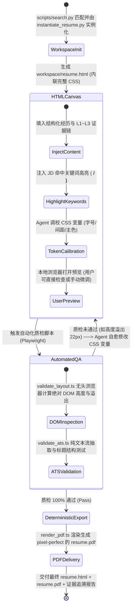
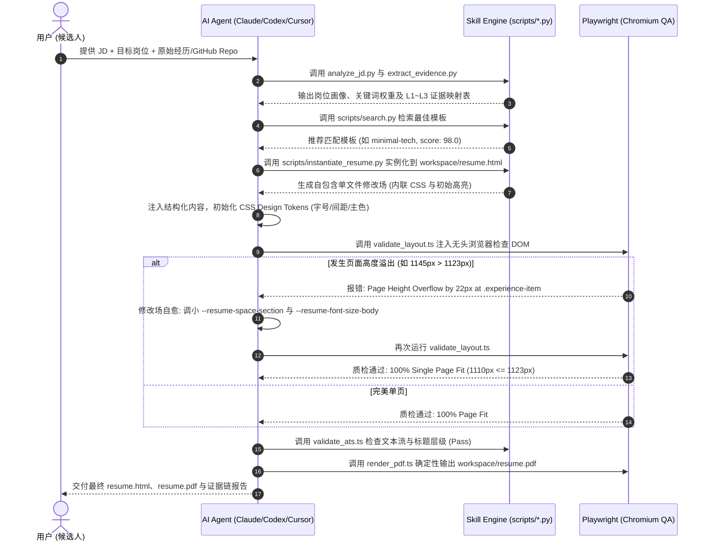
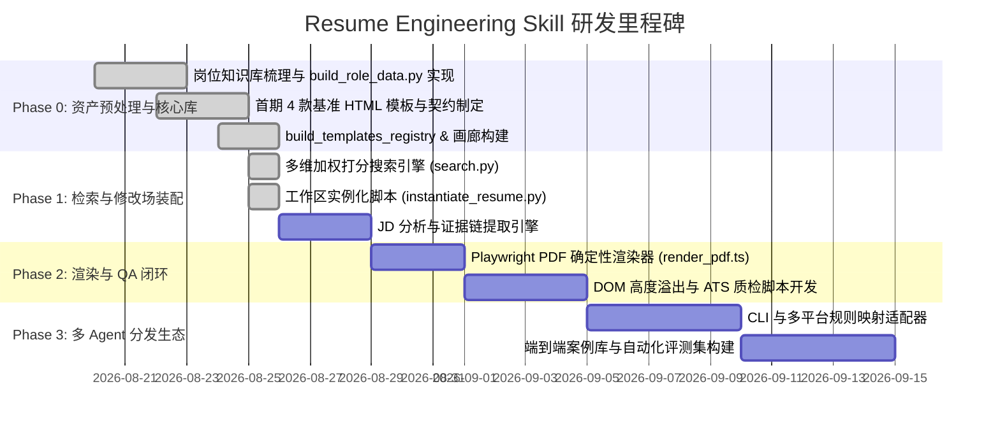

# Resume Engineering Skill — 产品与技术架构设计文档 (PRD & Architecture Spec)

> **定位：面向主流 AI Agent（Claude Code / Codex / Cursor / Windsurf / Gemini CLI / Copilot / OpenCode 等）的岗位定制型 HTML 简历设计、证据链编排与确定性 PDF 生成 Skill。**
>
> **版本：** v1.2.0-aligned  
> **开源协议：** MIT License  
> **核心范式：** Evidence-First + HTML Intermediate Canvas + Design Tokens + Multi-Agent Native Architecture  

---

## 目录

- [1. 项目定位与核心价值融合](#1-项目定位与核心价值融合)
  - [1.1 一句话定义](#11-一句话定义)
  - [1.2 四大参考项目与价值继承矩阵](#12-四大参考项目与价值继承矩阵)
  - [1.3 原始资产 (MD/DOC) 预处理与核心资源库入库规范](#13-原始资产-mddoc-预处理与核心资源库入库规范)
  - [1.4 四层核心资产体系](#14-四层核心资产体系)
- [2. 核心架构设计：为什么是「简历工程系统」](#2-核心架构设计为什么是简历工程系统)
  - [2.1 传统 AI 简历 vs 简历工程系统](#21-传统-ai-简历-vs-简历工程系统)
  - [2.2 Master Profile 到多岗位 Resume Variant 派生流](#22-master-profile-到多岗位-resume-variant-派生流)
  - [2.3 HTML 作为唯一修改场 (Intermediate Working Canvas) 的生命周期](#23-html-作为唯一修改场-intermediate-working-canvas-的生命周期)
- [3. 核心设计原则 (The 7 Core Principles)](#3-核心设计原则-the-7-core-principles)
- [4. 系统整体架构与技术栈选型决断](#4-系统整体架构与技术栈选型决断)
  - [4.1 六层分层架构图](#41-六层分层架构图)
  - [4.2 端到端闭环数据流](#42-端到端闭环数据流)
  - [4.3 技术栈深度对比与决断：HTML + Pure CSS vs HTML + Tailwind CSS](#43-技术栈深度对比与决断html--pure-css-vs-html--tailwind-css)
- [5. 项目源码结构 (Source-of-Truth 结构)](#5-项目源码结构-source-of-truth-结构)
- [6. 数据标准与 Schema 规范](#6-数据标准与-schema-规范)
  - [6.1 候选人主档案 Schema (`resume-schema.json`)](#61-候选人主档案-schema-resume-schemajson)
  - [6.2 岗位画像标准 Schema (`data/roles/*.json`)](#62-岗位画像标准-schema-datarolesjson)
  - [6.3 模板元数据与注册表标准 (`metadata.json` & `templates.json`)](#63-模板元数据与注册表标准-metadatajson--templatesjson)
  - [6.4 统一 Design Tokens (CSS 变量体系规范)](#64-统一-design-tokens-css-变量体系规范)
  - [6.5 通用 HTML 结构契约 (`resume-contract.md`)](#65-通用-html-结构契约-resume-contractmd)
- [7. 核心引擎与工具链实现规范](#7-核心引擎与工具链实现规范)
  - [7.1 岗位画像构建引擎 (`scripts/build_role_data.py`)](#71-岗位画像构建引擎-scriptsbuild_role_datapy)
  - [7.2 模板注册与画廊构建引擎 (`scripts/build_templates_registry.py`)](#72-模板注册与画廊构建引擎-scriptsbuild_templates_registrypy)
  - [7.3 多维加权打分搜索引擎 (`scripts/search.py`)](#73-多维加权打分搜索引擎-scriptssearchpy)
  - [7.4 工作区实例化引擎 (`scripts/instantiate_resume.py`)](#74-工作区实例化引擎-scriptsinstantiate_resumepy)
  - [7.5 JD 分析与关键词提取引擎 (`scripts/analyze_jd.py`)](#75-jd-分析与关键词提取引擎-scriptsanalyze_jdpy)
  - [7.6 证据链提取与防幻觉评定引擎 (`scripts/extract_evidence.py`)](#76-证据链提取与防幻觉评定引擎-scriptsextract_evidencepy)
  - [7.7 确定性 PDF 渲染器 (`scripts/render_pdf.ts`)](#77-确定性-pdf-渲染器-scriptsrender_pdfts)
  - [7.8 双重 QA 自动化验证引擎 (`scripts/validate_layout.ts` & `scripts/validate_ats.ts`)](#78-双重-qa-自动化验证引擎-scriptsvalidate_layoutts--scriptsvalidate_atsts)
- [8. 核心 HTML 模板库矩阵 (首期 4 套黄金基准)](#8-核心-html-模板库矩阵-首期-4-套黄金基准)
  - [8.1 首期 4 套核心模板设计分析](#81-首期-4-套核心模板设计分析)
  - [8.2 模板画廊交互预览体系 (`output/templates_gallery/`)](#82-模板画廊交互预览体系-outputtemplates_gallery)
  - [8.3 二期扩展模板演进矩阵 (10 套)](#83-二期扩展模板演进矩阵-10-套)
- [9. SKILL.md 核心工作流与 Agent 推理契约](#9-skillmd-核心工作流与-agent-推理契约)
- [10. 多 Agent 平台分发与生态接入](#10-多-agent-平台分发与生态接入)
  - [10.1 `skill.json` 元数据标准](#101-skilljson-元数据标准)
  - [10.2 平台配置文件自动映射规则](#102-平台配置文件自动映射规则)
  - [10.3 CLI 命令体系](#103-cli-命令体系)
- [11. 第三方资产策略与版权合规 (`THIRD_PARTY_NOTICES.md`)](#11-第三方资产策略与版权合规-third_party_noticesmd)
- [12. 研发路线图与里程碑 (Roadmap)](#12-研发路线图与里程碑-roadmap)
- [13. 总结](#13-总结)

---

## 1. 项目定位与核心价值融合

### 1.1 一句话定义
**Resume Engineering Skill** 是一个**面向主流 AI Agent 的岗位定制型 HTML 简历设计、证据链编排与确定性 PDF 生成系统**。它以纯 HTML/CSS 为唯一修改工作场，根据用户目标岗位/JD 深度分析候选人代码库与真实经历，自动匹配最佳版式与设计系统（Design Tokens），闭环完成微调调优与 ATS/分页质检，最终交付像素级确定性 PDF。

### 1.2 四大参考项目与价值继承矩阵

```
                         【四大参考项目与核心价值融合】
┌─────────────────────────────────────────────────────────────────────────────┐
│ 1. repo-to-resume-tailor (输入与内容智能层)                                   │
│    ▶ 解决「写什么」：Target-Role / JD 模式、L1~L3 证据分级、防幻觉纪律、技术栈提取   │
├─────────────────────────────────────────────────────────────────────────────┤
│ 2. ui-ux-pro-max-skill (系统架构与多 Agent 分发生态)                          │
│    ▶ 解决「系统怎么建」：Single Source of Truth、BM25 检索脚本、Design Tokens、CLI │
├─────────────────────────────────────────────────────────────────────────────┤
│ 3. ResumeSample (岗位分类与专业内容知识库)                                     │
│    ▶ 解决「岗位怎么写」：Web/后端/AI/架构师等岗位画像、FAB 模型、量化论据标准        │
├─────────────────────────────────────────────────────────────────────────────┤
│ 4. ResumeCollection (模板版式与视觉风格分类库)                                 │
│    ▶ 解决「版式怎么排」：单栏/双栏/紧凑/表格式等布局分类，提取设计模式重构为 HTML   │
└─────────────────────────────────────────────────────────────────────────────┘
                                      │
                                      ▼
             ┌─────────────────────────────────────────────────┐
             │            Resume Engineering Skill             │
             │   HTML Intermediate Canvas + Design Tokens      │
             │     + Playwright PDF Rendering + Multi-QA Loop  │
             └─────────────────────────────────────────────────┘
```

| 维度 | 参考项目 | 核心输入/价值 | 本项目升级与工程化落地策略 |
| :--- | :--- | :--- | :--- |
| **内容智能与入口** | `repo-to-resume-tailor` | 岗位/JD 模式匹配、代码库事实抽取、保守措辞规范 | 升级为 Skill 的**首要输入分析引擎**，提供 L1~L3 证据分级与防幻觉门禁，杜绝 AI 凭空编造事实。 |
| **系统架构与分发** | `ui-ux-pro-max-skill` | Single Source of Truth、BM25 检索、Master+Overrides 设计体系、统一 CLI | 完整复用其**分发与资产架构**，将现代设计系统思想应用到简历排版（Design Tokens），统一多平台 Agent 适配。 |
| **专业岗位知识库** | `geekcompany/ResumeSample` | 10+ 技术岗位分类、高频技能词频统计、FAB 论据表达模型 | **离线结构化重构**为 `data/roles/*.json`，为不同方向（AI/前端/后端/架构等）提供标准技能树与量化模版。 |
| **版式与风格矩阵** | `mmmlllnnn/ResumeCollection` | 丰富的中英文、多页、单双栏、紧凑表格版式分类 | 提炼其版式布局精华，**完全淘汰其脆弱且侵权的 .doc/.docx 原始文件**，用现代语义化 HTML5+CSS3 全量重构。 |

---

### 1.3 原始资产 (MD/DOC) 预处理与核心资源库入库规范

当前工程依赖的参考源包含非结构化的 `.md` 范例文档与遗留的 `.doc` 文件。**本方案严格确立「离线预处理入库」机制，严禁 Agent 在运行时动态解析 doc/md 模板**：

```
【原始资产离线预处理流水线 (Build-Time)】                【Skill 核心架构资产库 (Runtime Source-of-Truth)】
┌──────────────────────────────────────┐               ┌──────────────────────────────────────────────┐
│ 1. ResumeSample (*.md)               │               │ data/roles/*.json (岗位画像与能力模型)         │
│    - 提取岗位专业技术栈树               │───(Python)───>│ - frontend.json, ai-agent-engineer.json...   │
│    - 提炼 FAB 模型论据范例与词频        │ 预处理脚本     │ - mustHaveSkills, niceToHaveSkills, 证据信号 │
├──────────────────────────────────────┤               ├──────────────────────────────────────────────┤
│ 2. ResumeCollection (*.doc)          │               │ templates/{id}/ (工业级 HTML/CSS 模板资源库)  │
│    - 提取单双栏构图比例 (3:7, 3.5:6.5) │──(人工重构与)─>│ - template.html (100% 语义化骨架)            │
│    - 提取网格布局与视觉间距规范         │   现代编码)   │ - style.css (Design Tokens 变量体系)         │
│    - 完全废弃 DOC/DOCX 原始二进制文件 │               │ - metadata.json (检索多维打分元数据)          │
└──────────────────────────────────────┘               └──────────────────────────────────────────────┘
```

#### 为什么必须先期处理为 HTML 并沉淀到资源库？
1. **消除 Agent 运行时歧义与失败率**：Word (.doc/.docx) 格式解析极易发生格式错乱、字体缺失和边距崩坏，直接让 Agent 处理二进制文档是不可控的；
2. **MD 仅代表内容结构，缺乏物理排版能力**：Markdown 无法实现双栏流式混排、精确行高收紧、A4 打印媒体断点（Paged Media）等视觉工程诉求；
3. **保证零运行时构建依赖**：预处理为纯 HTML+CSS 模板后，Agent 运行时只需进行变量填充与 Token 调优，无需安装 Word 转换器或 Pandoc 等重型工具。

---

### 1.4 四层核心资产体系

本项目沉淀为**四层递进式智能知识库**：

```
┌───────────────────────────────────────────────────────────────────┐
│ 1. Role Intelligence (岗位画像智能库)                              │
│    岗位分类 → 能力维度矩阵 → 必备/加分技术栈 → 行业高频关键词        │
├───────────────────────────────────────────────────────────────────┤
│ 2. Resume Intelligence (简历经历智能库)                            │
│    项目/工作经历 → 证据链 (L1~L3) → FAB 论据模型 → 量化成果提炼     │
├───────────────────────────────────────────────────────────────────┤
│ 3. Template Intelligence (设计排版智能库)                         │
│    版式风格 (单栏/双栏/表格) × 职业特质 (研发/管理) → Design Tokens │
├───────────────────────────────────────────────────────────────────┤
│ 4. Rendering Intelligence (确定性渲染与自愈质检库)                 │
│    HTML 修改场 → Playwright Chromium → ATS 校验 → 溢出自愈微调 → PDF │
└───────────────────────────────────────────────────────────────────┘
```

---

## 2. 核心架构设计：为什么是「简历工程系统」

### 2.1 传统 AI 简历 vs 简历工程系统

```text
【传统 AI 简历生成模式 (黑盒/失控)】
用户资料 ──> LLM ──> 一段 Markdown ──> 外部转换器 ──> 格式混乱、容易幻觉、无法微调的 PDF

【Resume Engineering Skill 模式 (确定性工程闭环)】
Candidate Master Profile & Repos
       │
       ▼
JD & Target-Role Analysis ──> Evidence Mapping (L1~L3 防幻觉门禁)
       │
       ▼
Resume Strategy & Content Model (JSON)
       │
       ▼
Template Search Engine (scripts/search.py 多维打分推荐)
       │
       ▼
HTML Intermediate Working Canvas (workspace/resume.html)
       │
   [Agent 调参 / 用户检查] ──> Design Tokens Calibration (CSS Variables)
       │
       ▼
Playwright Headless Inspection & PDF Rendering
       │
       ▼
Dual QA: ATS Validation & Visual Page-Break Inspection
       │
   [Failed] ──> Agent Auto-Fix Spacing/FontSize Tokens ──> Re-Render
       │
   [Passed]
       ▼
Final Verified HTML + Pixel-Perfect PDF
```

---

### 2.2 Master Profile 到多岗位 Resume Variant 派生流

候选人的真实经历是一套完整且不可篡改的事实底座（Master Profile）。针对不同公司和岗位，不应每次重写一份独立的简历，而是**基于同一套 Master Profile 派生岗位定制的 Variant**：

```
                    ┌─────────────────────────────────┐
                    │ Candidate Master Profile (JSON) │
                    │ 包含个人所有项目、技能与代码库证据 │
                    └────────────────┬────────────────┘
                                     │
           ┌─────────────────────────┼─────────────────────────┐
           ▼                         ▼                         ▼
   【AI Agent 岗位】          【全栈研发岗位】           【技术管理/架构岗位】
   JD 匹配: RAG/Workflow     JD 匹配: React/Node/Cloud  JD 匹配: 架构/团队/商业
   策略: 强化模型与工具链     策略: 强化端到端交付能力    策略: 强化架构设计与影响力
   模板: modern-split-sidebar 模板: minimal-tech         模板: executive-split
           │                         │                         │
           ▼                         ▼                         ▼
   resume-ai-agent.pdf       resume-fullstack.pdf       resume-executive.pdf
```

---

### 2.3 HTML 作为唯一修改场 (Intermediate Working Canvas) 的生命周期

为了保证“排版所见即所得”与“Agent 可控可调”，系统确立 **HTML 是全流程唯一的中间修改场与工作底座**，所有生成、微调、自愈 QA 全在 HTML 层面完成，最终一步输出 PDF：



#### 修改场工作原则：
1. **单文件自包含（Single-File Self-Contained）**：`instantiate_resume.py` 将模板的 `style.css` 与 `template.html` 完整内联，零外部网络字体与脚本依赖，本地双击即可完美渲染；
2. **严禁修改事实，允许修改表现**：Agent 在修改场中仅可调整 CSS Tokens、Bullet 表达精简度、技能分类顺序，绝不篡改历史客观数据；
3. **断点保护与自愈反馈**：QA 脚本直接反馈具体的溢出节点选择器与超标高度（如 `.experience-item overflow by 18px`），Agent 有针对性地对 `--resume-space-section` 与 `--resume-font-size-body` 进行像素级微调。

---

## 3. 核心设计原则 (The 7 Core Principles)

### P1 — Evidence First (证据纪律与防幻觉)
不允许 AI 编造候选人经历。简历的每一条主张必须具有可追溯的证据支撑：
* **Level 1 (强证据)**：代码实现、配置文件、API 契约、文档、实际部署流水线。
* **Level 2 (中证据)**：目录组织、技术选型依赖项、模块命名、关联推断。
* **Level 3 (弱推论)**：根据上下文合理推测（必须采用保守句式，如“参与…的实现”）。
* **Unsupported (无证据)**：严禁写入；若匹配 JD 缺失，需向候选人提示补充，而非由 AI 虚构。

### P2 — Content / Design Separation (内容数据与设计体系解耦)
内容以标准的 `resume-schema.json` 形式存在，与模板 HTML/CSS 完全分离。同一份候选人事实数据，可即时映射到 `minimal-tech`、`modern-split-sidebar` 或 `executive-split` 等不同模板。

### P3 — HTML Intermediate Canvas (以 HTML 为唯一修改场)
放弃受限的 Markdown 与脆弱的 LaTeX，以现代语义化 HTML + CSS Variables 为工作台。所有微调、排版自愈、交互校验均在 HTML 上闭环，最后确定性输出 PDF。

### P4 — Agent Editable (明确 Agent 的修改边界)
* **允许 Agent 修改**：CSS 变量（颜色、字体、行高、间距）、Section 排序、技术栈高亮、经历详略程度、分页断点。
* **禁止 Agent 篡改**：公司名称、任职起止时间、学历背景、核心技术事实与未经证实的业务数字。

### P5 — Deterministic Rendering (确定性渲染)
采用 Playwright / Chromium 无头浏览器直接加载标准 HTML 渲染，开启 `@media print` 与 `preferCSSPageSize: true`，消除跨操作系统字体渲染与浏览器解析差异。

### P6 — Validate Before Output (交付前双重校验与自动修复)
生成 PDF 前后必须执行：
1. **ATS 兼容性检查**：纯文本可提取性、标头层级、无文本图片化、关键词密度。
2. **视觉与分页检查**：总页数校验（严格 1 页或 2 页）、元素边界溢出检测、孤行标题检测。若失败，Agent 自动缩减间距/字号或精简文字，重新渲染直至合规。

### P7 — Multi-Agent Native (全 Agent 平台标准化分发)
沿袭 `ui-ux-pro-max-skill` 的体系，通过统一的 `skill.json`、CLI 工具与适配器模板，一次构建，即可分发至 Claude Code、Codex、Cursor、Windsurf、Gemini CLI 等 20+ 平台。

---

## 4. 系统整体架构与技术栈选型决断

### 4.1 六层分层架构图

```
┌─────────────────────────────────────────────────────────────────────────────┐
│ 1. Multi-Agent Ecosystem (分发适配层)                                         │
│    Claude Code | Codex | Cursor | Windsurf | Gemini CLI | Copilot | OpenCode│
└──────────────────────────────────────┬──────────────────────────────────────┘
                                       │ CLI 注入 (~/.claude, ~/.codex, .cursorrules)
┌──────────────────────────────────────▼──────────────────────────────────────┐
│ 2. Skill Execution Core (Agent 执行契约层 - SKILL.md)                        │
│    Reasoning Contract | 阶段门禁 | 证据防幻觉纪律 | HTML 工作区自愈指令集        │
└──────────────────────────────────────┬──────────────────────────────────────┘
                                       │ 命令行 / Python 检索与装配调用
┌──────────────────────────────────────▼──────────────────────────────────────┐
│ 3. Retrieval & Reasoning Engine (检索与推理引擎层 - scripts/)                │
│    search.py (多维加权打分) │ instantiate_resume.py │ analyze_jd.py          │
│    build_role_data.py       │ build_templates_registry.py │ extract_evidence│
└──────────────────────────────────────┬──────────────────────────────────────┘
                                       │ 结构化数据驱动
┌──────────────────────────────────────▼──────────────────────────────────────┐
│ 4. Resume Knowledge & Data Assets (结构化资产层 - src/resume-engineering/data)│
│    roles/*.json (11+岗位画像)│ layouts.json │ styles.json │ templates.json  │
└──────────────────────────────────────┬──────────────────────────────────────┘
                                       │ 模板实例化到修改场 (workspace/resume.html)
┌──────────────────────────────────────▼──────────────────────────────────────┐
│ 5. HTML Resume Template Engine (核心模板资源层 - templates/)                 │
│    minimal-tech │ modern-split-sidebar │ executive-split │ table-structured │
│    CSS Variables Design Tokens │ A4 绝对分页约束 (@page & break-inside)     │
└──────────────────────────────────────┬──────────────────────────────────────┘
                                       │ 无头浏览器渲染与校验
┌──────────────────────────────────────▼──────────────────────────────────────┐
│ 6. Rendering & QA Closed-Loop (确定性渲染与验收层)                           │
│    Playwright Chromium 渲染 │ validate_layout (溢出检查) │ validate_ats (解析) │
└─────────────────────────────────────────────────────────────────────────────┘
```

---

### 4.2 端到端闭环数据流



---

### 4.3 技术栈深度对比与决断：HTML + Pure CSS vs HTML + Tailwind CSS

针对无头浏览器（Playwright）打印渲染、AI Agent 自动微调与模板维护场景，对两种方案做严谨的技术对比：

| 对比维度 | 原生 HTML5 + 纯 CSS3 (Design Tokens) | HTML + Tailwind CSS (CDN / 独立编译) | 架构决断与权衡理由 |
| :--- | :--- | :--- | :--- |
| **离线与确定性** | **100% 确定性**：单个 HTML 内嵌 `<style>`，零外部网络请求，秒级加载。 | **高风险**：CDN 模式在 Playwright 中存在网络延迟与样式计算闪烁；本地编译则需引入 Node 打包流水线。 | **纯 CSS 胜出**：无外部构建负担，离线完全确定。 |
| **A4 分页与打印控制** | **完全精准**：原生支持 `@page { size: A4 portrait; margin: 0; }`，`break-inside: avoid`，`pt/mm` 绝对印刷单位。 | **受限**：Tailwind 专注于响应式 Web 屏幕流式布局，对 Paged Media（物理页断点、孤行控制）支持薄弱。 | **纯 CSS 胜出**：打印媒体查询是简历排版的底座。 |
| **Agent 自动调参自愈成本** | **极低且精确**：全局变量集中在 `:root`，Agent 仅需修改一行 `--resume-space-section: 9pt;` 即可全局缩放。 | **极高且脆弱**：类名分散在数百个 DOM 节点（如 `mb-3 text-sm`），Agent 需遍历修改几十处标签，极易遗漏或改乱结构。 | **纯 CSS 胜出**：Token 集中化是 Agent 自愈的关键。 |
| **现代视觉品质** | 取决于基础 Design Tokens 与微排版规范的定义。 | 开箱即用现代色彩阶梯（Slate/Zinc/Indigo）与精致间距。 | **吸收 Tailwind 规范**：将 Tailwind 的视觉阶梯固化为 CSS 变量。 |

#### 决策方案：原生 HTML5/CSS3 架构 + 深度内化 Tailwind 设计规范
* **绝对不引入 Tailwind 的构建工具链、PostCSS 或 CDN 脚本**；
* **全面内化 Tailwind 的视觉系统精华**：在 `style.css` 中将 Tailwind 经典的色彩阶梯（Slate/Indigo/Emerald）、微排版比例（Type Scale）与圆角规范直接定义为标准 **CSS Variables (Design Tokens)**。

---

## 5. 项目源码结构 (Source-of-Truth 结构)

```text
knowme-careerforge-skill/
├── README.md                           # 英文项目说明
├── README.zh-CN.md                    # 中文项目说明
├── LICENSE                            # MIT 开源协议
├── skill.json                         # Skill 元数据与平台清单 (参照 ui-ux-pro-max)
├── SKILL.md                           # Core Skill 推理入口与 Agent 执行契约
├── AGENT.md                           # 吸收 Vercel Editorial 规范的 Agent 行为与排版手册
├── ARCHITECTURE.md                    # 6 层系统架构、数据流与 Deep Module Seam 设计
├── CLAUDE.md                          # 开发者指令与测试速查指南
├── pyproject.toml                     # Python 工具链配置 (零重型第三方依赖)
├── package.json                       # Playwright & TypeScript 依赖
├── THIRD_PARTY_NOTICES.md             # 第三方模板与知识库溯源及合规说明
│
├── docs/
│   ├── decisions/                     # 【架构决策记录 (ADRs)】
│   │   ├── 0001-html-intermediate-canvas.md
│   │   ├── 0002-pure-css-design-tokens-over-tailwind.md
│   │   ├── 0003-two-tier-tokens-architecture.md
│   │   └── 0004-decentralized-json-with-bm25-index.md
│   └── dev/
│       └── RESUME_ENGINEERING_SKILL_DESIGN.md # 本技术全景设计手册
│
├── references/                        # 【6 阶段深度运行时规范手册 (L3)】
│   ├── 01-evidence-mining.md          # L1~L3 证据分级与代码仓/Git 挖掘
│   ├── 02-career-goal.md              # 职级信号、能力矩阵与价值主张
│   ├── 03-jd-analysis.md              # JD 痛点抽取、关键词密度与 FAB 模型
│   ├── 04-template-selection.md       # 模板矩阵、布局几何与可插拔搜索
│   ├── 05-html-canvas-tokens.md       # HTML 中间修改场与两层 Tokens 自愈
│   └── 06-qa-and-rendering.md         # DOM 高度质检、ATS 规则与确定性 PDF 导出
│
├── src/
│   ├── knowledge/                     # 【结构化数据资产 (Source of Truth)】
│   │   ├── roles/                     # 9+ 岗位技能画像 (JSON Schema 规范)
│   │   │   ├── frontend.json, java-backend.json, ai-agent-engineer.json...
│   │   ├── layouts.json               # 布局几何分类 (单栏极简、双栏侧栏、表格网格)
│   │   ├── styles.json                # 视觉风格与配色方案 (Modern, Minimal, Executive...)
│   │   ├── ats-rules.json             # ATS 解析友好性检查规则集
│   │   ├── index.json                 # 岗位与模板编译聚合总索引
│   │   └── resume-schema.json         # 候选人主档案与证据链 JSON Schema
│   │
│   └── templates/                     # 【核心 HTML/CSS 模板资源库】
│       ├── common/
│       │   ├── base.css               # Primitive Tokens (色板/间距阶梯) + A4 绝对打印契约
│       │   └── resume-contract.md     # 全模板必须遵循的 HTML 契约与 A4 几何标准
│       ├── minimal/                   # 【单栏 × 研发】极简极客单栏模板 (style.css, template.html, metadata.json)
│       ├── modern/                    # 【双栏 × 研发/全栈】现代深海蓝侧边栏模板 (32:68 黄金比例)
│       ├── executive/                 # 【深色Banner+双栏 × 管理】技术总监/架构师模板 (33:67)
│       └── classic/                   # 【结构化表格 × 综合】政企/国企/合规岗位高密度表格模板
│
├── scripts/                           # 【核心工具链与引擎 (6 大领域模块)】
│   ├── Agent.md                       # 脚本调用契约与开发者手册
│   ├── pipeline/                      # 【模块 1: 端到端管线】
│   │   └── forge.py                   # 一键全流程管线 (挖掘 -> 匹配 -> 装配 -> QA -> PDF)
│   ├── evidence/                      # 【模块 2: 事实与证据挖掘 (repo-to-resume)】
│   │   ├── extract-evidence.py        # 代码仓与 Git 事实挖掘器 (生成 L1~L3 证据链)
│   │   └── analyze-jd.py              # 目标 JD 深度分析器 (提取技能、关键词、痛点)
│   ├── template/                      # 【模块 3: 模板检索与画布装配】
│   │   ├── search-template.py         # Pluggable 搜索引擎 (Weighted + BM25 + Hybrid)
│   │   └── instantiate-resume.py      # 单文件内联合并 (base.css + style.css + 数据注入)
│   ├── validation/                    # 【模块 4: 双重 QA 自动化质检】
│   │   ├── validate-resume.py         # 语义结构、Design Tokens 与字符密度轻量校验
│   │   ├── validate-layout.ts         # Playwright DOM 盒模型物理高度 (1122.5px A4) 溢出检测
│   │   └── validate-ats.ts            # ATS 纯文本流解析、联系方式与标头层级校验
│   ├── rendering/                     # 【模块 5: 确定性 PDF 渲染导出】
│   │   ├── render-pdf.py              # 跨平台多策略浏览器自适应 PDF 渲染调度器
│   │   └── render-pdf.ts              # Playwright 无损矢量 A4 PDF 渲染器
│   └── build/                         # 【模块 6: 编译构建、测试与发布】
│       ├── build-knowledge.py         # 岗位画像与模板知识库索引编译器
│       ├── build-gallery.py           # 静态交互式模板画廊生成器 (output/templates_gallery/)
│       ├── run-all-tests.py           # 全链路自动化测试运行器
│       ├── sync-version.py            # 多清单版本号同步器
│       └── release.py                 # 自动化发布流水线引擎
│
├── cli/                               # 【统一分发 CLI (knowme)】
│   ├── src/
│   │   ├── commands/ (init.ts, list.ts)
│   │   └── index.ts
│   └── package.json
│
├── agents/                            # 【多 Agent 平台适配配置】
│   ├── claude/knowme-careerforge.md
│   ├── codex/knowme-careerforge.yaml
│   ├── cursor/knowme-careerforge.mdc
│   ├── windsurf/knowme-careerforge.rules
│   ├── gemini/knowme-careerforge.json
│   └── opencode/skill.yaml
│
├── workspace/                         # 【中间工作区修改场】
│   ├── resume.html                    # 当前编辑中的自包含单文件 HTML (Canvas)
│   ├── resume.pdf                     # 质检通过后导出的确定性 PDF
│   └── evidence-master.json           # 结构化候选人事实底座
│
├── output/
│   └── templates_gallery/             # 4 套模板静态交互预览画廊
│
└── tests/                             # 【全链路 24 项自动化测试集】
    ├── ats/
    ├── rendering/
    ├── templates/
    └── workflows/
```

---

## 6. 数据标准与 Schema 规范

### 6.1 候选人主档案 Schema (`resume-schema.json`)

```json
{
  "$schema": "http://json-schema.org/draft-07/schema#",
  "title": "CandidateResumeSchema",
  "type": "object",
  "required": ["basics", "experience", "skills", "education"],
  "properties": {
    "basics": {
      "type": "object",
      "required": ["name", "title", "email", "phone"],
      "properties": {
        "name": { "type": "string" },
        "title": { "type": "string" },
        "email": { "type": "string", "format": "email" },
        "phone": { "type": "string" },
        "location": { "type": "string" },
        "website": { "type": "string" },
        "github": { "type": "string" },
        "summary": { "type": "string" }
      }
    },
    "skills": {
      "type": "array",
      "items": {
        "type": "object",
        "required": ["category", "items"],
        "properties": {
          "category": { "type": "string" },
          "items": { "type": "array", "items": { "type": "string" } },
          "highlighted": { "type": "array", "items": { "type": "string" } }
        }
      }
    },
    "experience": {
      "type": "array",
      "items": {
        "type": "object",
        "required": ["company", "role", "startDate", "endDate", "bullets"],
        "properties": {
          "company": { "type": "string" },
          "role": { "type": "string" },
          "startDate": { "type": "string" },
          "endDate": { "type": "string" },
          "location": { "type": "string" },
          "summary": { "type": "string" },
          "bullets": {
            "type": "array",
            "items": {
              "type": "object",
              "required": ["text", "evidenceLevel"],
              "properties": {
                "text": { "type": "string" },
                "evidenceLevel": { "type": "string", "enum": ["L1", "L2", "L3"] },
                "evidenceSource": { "type": "string" },
                "keywords": { "type": "array", "items": { "type": "string" } }
              }
            }
          }
        }
      }
    },
    "projects": {
      "type": "array",
      "items": {
        "type": "object",
        "required": ["name", "role", "techStack", "bullets"],
        "properties": {
          "name": { "type": "string" },
          "role": { "type": "string" },
          "techStack": { "type": "array", "items": { "type": "string" } },
          "repoUrl": { "type": "string" },
          "demoUrl": { "type": "string" },
          "startDate": { "type": "string" },
          "endDate": { "type": "string" },
          "bullets": {
            "type": "array",
            "items": {
              "type": "object",
              "required": ["text", "evidenceLevel"],
              "properties": {
                "text": { "type": "string" },
                "evidenceLevel": { "type": "string", "enum": ["L1", "L2", "L3"] },
                "evidenceSource": { "type": "string" }
              }
            }
          }
        }
      }
    },
    "education": {
      "type": "array",
      "items": {
        "type": "object",
        "required": ["institution", "degree", "startDate", "endDate"],
        "properties": {
          "institution": { "type": "string" },
          "degree": { "type": "string" },
          "field": { "type": "string" },
          "startDate": { "type": "string" },
          "endDate": { "type": "string" },
          "gpa": { "type": "string" },
          "honors": { "type": "array", "items": { "type": "string" } }
        }
      }
    }
  }
}
```

---

### 6.2 岗位画像标准 Schema (`data/roles/*.json`)

```json
{
  "id": "ai-agent-engineer",
  "name": "AI Agent / LLM 算法与应用工程师",
  "category": "engineering-ai",
  "mustHaveSkills": [
    "Python",
    "LLM Orchestration",
    "RAG 架构",
    "Tool Calling",
    "FastAPI",
    "VectorDB (Qdrant/Milvus)"
  ],
  "niceToHaveSkills": [
    "LangGraph",
    "LlamaIndex",
    "Prompt Engineering",
    "模型评测与微调",
    "Docker/K8s",
    "TypeScript"
  ],
  "evidenceSignals": [
    "多 Agent 协同工作流",
    "检索增强生成 RAG",
    "Prompt 动态剪枝与降本",
    "长上下文窗口治理",
    "企业知识库落地"
  ],
  "sectionPriority": [
    "skills",
    "projects",
    "experience",
    "education"
  ],
  "keywords": [
    "Python",
    "LLM Orchestration",
    "RAG 架构",
    "Tool Calling",
    "FastAPI",
    "VectorDB",
    "LangGraph"
  ]
}
```

---

### 6.3 模板元数据与注册表标准 (`metadata.json` & `templates.json`)

#### 单个模板 `metadata.json`：
```json
{
  "id": "minimal-tech",
  "name": "Minimal Tech",
  "version": "1.0.0",
  "style": "single-column-minimal",
  "roleCategory": "engineering-ai",
  "layout": {
    "type": "single-column",
    "targetPages": 1,
    "maxPages": 2,
    "density": "high"
  },
  "visualStyle": {
    "tone": "geek-minimal",
    "accentColor": "#2563eb",
    "fontFamily": "System Sans-Serif"
  },
  "atsScoreTier": "tier-1-optimal",
  "supportedRoles": [
    "frontend",
    "backend",
    "fullstack",
    "ai-agent-engineer",
    "devops",
    "architect"
  ],
  "languages": ["zh-CN", "en-US"],
  "customizableTokens": [
    "--resume-font-size-body",
    "--resume-space-section",
    "--resume-space-item",
    "--resume-space-bullet",
    "--resume-color-accent"
  ]
}
```

#### 注册表总索引 `src/resume-engineering/data/templates.json`（由 `build_templates_registry.py` 自动扫描 `style.css` 变量并生成）：
```json
{
  "version": "1.0.0",
  "totalTemplates": 4,
  "templates": [
    {
      "id": "minimal-tech",
      "name": "Minimal Tech",
      "style": "single-column-minimal",
      "roleCategory": "engineering-ai",
      "layout": { "type": "single-column", "targetPages": 1, "maxPages": 2, "density": "high" },
      "visualStyle": { "tone": "geek-minimal", "accentColor": "#2563eb", "fontFamily": "System Sans-Serif" },
      "atsScoreTier": "tier-1-optimal",
      "supportedRoles": ["frontend", "backend", "fullstack", "ai-agent-engineer", "devops", "architect"],
      "customizableTokens": ["--resume-font-size-body", "--resume-space-section", "--resume-space-item", "--resume-space-bullet", "--resume-color-accent"],
      "detectedTokens": ["--resume-color-accent", "--resume-color-border", "--resume-font-size-body", "--resume-page-min-height", "--resume-page-width", "--resume-space-section"],
      "directory": "templates/minimal-tech"
    },
    {
      "id": "modern-split-sidebar",
      "name": "Modern Split Sidebar",
      "style": "two-column-split",
      "roleCategory": "engineering-ai",
      "layout": { "type": "two-column-sidebar", "targetPages": 1, "maxPages": 2, "sidebarRatio": "32:68", "density": "balanced" },
      "visualStyle": { "tone": "modern-deep-navy", "sidebarBg": "#254665", "accentColor": "#254665", "fontFamily": "System Sans-Serif" },
      "atsScoreTier": "tier-1-optimal",
      "supportedRoles": ["frontend", "backend", "fullstack", "ai-agent-engineer", "product-manager", "architect"],
      "directory": "templates/modern-split-sidebar"
    },
    {
      "id": "executive-split",
      "name": "Executive Modern Split",
      "style": "two-column-split",
      "roleCategory": "management-product",
      "layout": { "type": "two-column-split", "targetPages": 1, "maxPages": 2, "leftRatio": "33:67", "density": "balanced" },
      "visualStyle": { "tone": "executive-formal", "bannerBg": "#1e293b", "accentColor": "#0f766e", "fontFamily": "System Sans-Serif" },
      "atsScoreTier": "tier-1-optimal",
      "supportedRoles": ["architect", "tech-director", "product-manager", "engineering-lead", "cto"],
      "directory": "templates/executive-split"
    },
    {
      "id": "table-structured",
      "name": "Table Structured Modern",
      "style": "table-structured",
      "roleCategory": "engineering-ai",
      "layout": { "type": "table-grid", "targetPages": 1, "maxPages": 1, "density": "high" },
      "visualStyle": { "tone": "structured-formal", "accentColor": "#1d4ed8", "fontFamily": "System Sans-Serif" },
      "atsScoreTier": "tier-1-optimal",
      "supportedRoles": ["frontend", "backend", "fullstack", "hardware", "civil-servant", "corporate"],
      "directory": "templates/table-structured"
    }
  ]
}
```

---

### 6.4 统一 Design Tokens (CSS 变量体系规范)

```css
:root {
  /* 页面绝对 A4 尺寸与安全边距 (CSS Paged Media) */
  --resume-page-width: 210mm;
  --resume-page-min-height: 297mm;
  --resume-page-padding: 14mm 16mm;

  /* 现代科技色系 (吸收 Tailwind Slate/Blue 规范) */
  --resume-color-primary: #0f172a;       /* Slate 900 */
  --resume-color-secondary: #334155;     /* Slate 700 */
  --resume-color-muted: #64748b;         /* Slate 500 */
  --resume-color-accent: #2563eb;        /* Tech Blue 600 */
  --resume-color-accent-bg: #eff6ff;     /* Blue 50 */
  --resume-color-border: #e2e8f0;        /* Slate 200 */
  --resume-color-tag-bg: #f1f5f9;        /* Slate 100 */
  --resume-color-sidebar-bg: #254665;    /* 侧边栏深色背景 */
  --resume-color-sidebar-text: #ffffff;  /* 侧边栏反白文字 */

  /* 字阶系统与行高 */
  --resume-font-body: -apple-system, BlinkMacSystemFont, "Segoe UI", "PingFang SC", "Hiragino Sans GB", "Microsoft YaHei", sans-serif;
  --resume-font-size-name: 20pt;
  --resume-font-size-target: 10.5pt;
  --resume-font-size-h2: 12pt;
  --resume-font-size-h3: 10pt;
  --resume-font-size-body: 9.2pt;
  --resume-font-size-meta: 8.5pt;
  --resume-line-height-body: 1.45;

  /* 间距 Tokens (Agent 解决 1.1 页溢出问题的核心自愈控制点) */
  --resume-space-header-bottom: 11pt;
  --resume-space-section: 11pt;
  --resume-space-item: 7.5pt;
  --resume-space-bullet: 2.5pt;
}

@media print {
  @page {
    size: A4 portrait;
    margin: 0; /* 禁用系统打印白边，完全由模板 padding 接管 */
  }
  body {
    -webkit-print-color-adjust: exact;
    print-color-adjust: exact;
    background: transparent;
    padding: 0;
  }
  .resume-page {
    box-shadow: none;
    margin: 0;
    width: var(--resume-page-width);
    min-height: var(--resume-page-min-height);
    padding: var(--resume-page-padding);
    page-break-after: always;
    page-break-inside: avoid;
  }
  .avoid-break {
    break-inside: avoid;
    page-break-inside: avoid;
  }
}
```

---

### 6.5 通用 HTML 结构契约 (`resume-contract.md`)

全库模板均遵守 `src/resume-engineering/templates/common/resume-contract.md` 规范：
* **根容器**：`<div class="resume-page" id="page-1">`
* **头部结构**：`header.resume-header` / `aside.resume-sidebar`
  * 姓名：`h1.candidate-name`
  * 意向：`p.job-target` 或 `span.badge-item`
* **模块结构**：`section.resume-section`
  * 标题：`h2.section-title`
  * 经历：`div.experience-item > div.item-header + ul.bullet-list`
  * 项目：`div.project-item > div.item-header + div.tech-stack-tags + ul.bullet-list`
  * 技能：`div.skills-container > div.skill-group`
  * 教育：`div.education-item > div.item-header`

---

## 7. 核心引擎与工具链实现规范

### 7.1 岗位画像构建引擎 (`scripts/build_role_data.py`)

负责将 `ResumeSample/` 中的 Markdown 样例文档解析结构化，并注入现代 AI 与产品岗位，输出到 `src/resume-engineering/data/roles/*.json`：

```python
#!/usr/bin/env python3
"""
Role Knowledge Base Builder (ResumeSample/*.md -> data/roles/*.json)
将 ResumeSample 中的岗位范例、技能树、FAB 论据模型结构化提取为标准 JSON 岗位画像。
"""
import os, sys, json, re
from pathlib import Path

ROLE_MAPPINGS = {
    "web": {"id": "frontend", "name": "Web前端开发工程师 / 前端架构师", "category": "engineering-ai"},
    "java": {"id": "java-backend", "name": "Java 后端开发工程师 / 资深研发", "category": "engineering-ai"},
    "node": {"id": "node-fullstack", "name": "Node.js 全栈工程师 / 后端开发", "category": "engineering-ai"},
    "android": {"id": "android-engineer", "name": "Android 客户端开发工程师", "category": "engineering-ai"},
    "ios": {"id": "ios-engineer", "name": "iOS 客户端开发工程师", "category": "engineering-ai"},
    "architect": {"id": "architect", "name": "分布式系统架构师 / 首席架构师", "category": "management-product"},
    "c": {"id": "cpp-systems", "name": "C/C++ 系统与底层开发工程师", "category": "engineering-ai"},
    "php": {"id": "php-engineer", "name": "PHP 后端工程师 / 全栈工程师", "category": "engineering-ai"}
}
```

---

### 7.2 模板注册与画廊构建引擎 (`scripts/build_templates_registry.py`)

扫描 `src/resume-engineering/templates/` 下的所有模板，提取 `metadata.json` 与 `style.css` 中的 Design Tokens，生成总注册表 `data/templates.json`，并编译静态画廊页面 `output/templates_gallery/index.html`：

```python
#!/usr/bin/env python3
"""
Template Registry & Gallery Builder
扫描验证 src/resume-engineering/templates/ 核心模板，生成 data/templates.json 注册表与 output/templates_gallery/ 预览画廊。
"""
import os, sys, json, re
from pathlib import Path

def build_templates_registry():
    templates_dir = Path("src/resume-engineering/templates")
    data_dir = Path("src/resume-engineering/data")
    gallery_dir = Path("output/templates_gallery")
    # 扫描 metadata.json, 提取 detectedTokens, 生成 templates.json 与画廊
```

---

### 7.3 多维加权打分搜索引擎 (`scripts/search.py`)

输入目标岗位名称、风格倾向、目标页数与密度，执行加权检索：
$$\text{Score} = (\text{RoleMatch} \times 0.35) + (\text{StyleMatch} \times 0.25) + (\text{ATSTier} \times 0.20) + (\text{PageFit} \times 0.10) + (\text{Density} \times 0.10)$$

```bash
# 命令行调用示例
python scripts/search.py "AI Agent Engineer" --style "two-column-split" --target-pages 1
```

输出示例：
```text
Found 4 matching templates (ranked by score):
--------------------------------------------------------------------------------
1. [Score: 98.0] Modern Split Sidebar (ID: modern-split-sidebar)
   Category: engineering-ai | Style: two-column-split | ATS Tier: tier-1-optimal
   Target Pages: 1 (Max: 2) | Density: balanced
   Accent: #254665 | Tone: modern-deep-navy
   Customizable Tokens: --resume-font-size-body, --resume-space-section, --resume-space-item, --resume-sidebar-width, --resume-color-sidebar-bg
   Directory: templates/modern-split-sidebar
```

---

### 7.4 工作区实例化引擎 (`scripts/instantiate_resume.py`)

将选中的模板 HTML 与 CSS 内联组装，注入关键词高亮标记，生成自包含的中间修改场 `workspace/resume.html`：

```python
#!/usr/bin/env python3
"""
Resume Workspace Instantiator (Template + Schema Data -> workspace/resume.html)
将指定模板与结构化候选人数据组装为自包含的 HTML 工作区修改场 (Intermediate Working Canvas)。
"""
import sys, os, json, argparse, re
from pathlib import Path

def instantiate_workspace(template_id, keywords=None, output_path="workspace/resume.html"):
    template_dir = Path(f"src/resume-engineering/templates/{template_id}")
    html_content = (template_dir / "template.html").read_text(encoding="utf-8")
    css_content = (template_dir / "style.css").read_text(encoding="utf-8")
    # 内联 CSS 形成单文件自包含修改场
    inlined_html = html_content.replace(
        '<link rel="stylesheet" href="style.css">',
        f'<style>\n{css_content}\n  </style>'
    )
    # 注入高亮
    out_file = Path(output_path)
    out_file.parent.mkdir(parents=True, exist_ok=True)
    out_file.write_text(inlined_html, encoding="utf-8")
    return out_file
```

---

### 7.5 JD 分析与关键词提取引擎 (`scripts/analyze_jd.py`)

```python
#!/usr/bin/env python3
"""
JD Analyzer - 提取 JD 中的核心岗位能力、必备/加分技术栈与关键指标
"""
import sys, json

def analyze_jd(jd_text: str) -> dict:
    return {
        "detected_role": "Senior AI Agent Engineer",
        "role_category": "engineering-ai",
        "seniority": "senior",
        "must_have_skills": ["Python", "LLM", "RAG", "FastAPI"],
        "nice_to_have_skills": ["LangGraph", "Docker", "Kubernetes"],
        "responsibilities_keywords": ["agent workflow", "prompt optimization", "latency reduction"]
    }
```

---

### 7.6 证据链提取与防幻觉评定引擎 (`scripts/extract_evidence.py`)

```python
#!/usr/bin/env python3
"""
Evidence Engine - 基于候选人原始经历与代码库判定证据等级 (L1~L3)
"""
def grade_evidence(claim: str, repo_facts: list) -> dict:
    return {
        "claim": claim,
        "evidence_level": "L1",
        "confidence": 0.95,
        "recommended_wording": claim
    }
```

---

### 7.7 确定性 PDF 渲染器 (`scripts/render_pdf.ts`)

```typescript
import { chromium } from 'playwright';
import * as path from 'path';

interface RenderOptions {
  htmlPath: string;
  outputPath: string;
}

export async function renderResumeToPdf(options: RenderOptions): Promise<void> {
  const browser = await chromium.launch({ headless: true });
  const context = await browser.newContext({
    viewport: { width: 794, height: 1123 }, // A4 at 96 DPI
    deviceScaleFactor: 2
  });
  
  const page = await context.newPage();
  const absoluteHtmlPath = path.resolve(options.htmlPath);
  await page.goto(`file://${absoluteHtmlPath}`, { waitUntil: 'networkidle' });

  // 严格等待所有 Web 字体与静态资源准备就绪
  await page.evaluateHandle('document.fonts.ready');

  await page.pdf({
    path: options.outputPath,
    format: 'A4',
    printBackground: true,
    preferCSSPageSize: true,
    margin: { top: '0px', right: '0px', bottom: '0px', left: '0px' }
  });

  await browser.close();
}
```

---

### 7.8 双重 QA 自动化验证引擎 (`scripts/validate_layout.ts` & `scripts/validate_ats.ts`)

1. **视觉与分页溢出检测 (`scripts/validate_layout.ts`)**：
   - 注入无头浏览器计算 `.resume-page` 实际高度。
   - 单页简历标准高度：$297\text{mm} \times 96\text{DPI} / 25.4 \approx 1122.5\text{px}$。
   - 若超出，精确输出超标像素（如 `Overflow: 18px at .experience-item`），驱动 Agent 定向修改 CSS 变量。
2. **ATS 兼容性检测 (`scripts/validate_ats.ts`)**：
   - 提取纯文本流，检测姓名、电话、邮箱、核心技术词是否可被正常解析提取。
   - 确保标题层级结构规范完整。

---

## 8. 核心 HTML 模板库矩阵 (首期 4 套黄金基准)

### 8.1 首期 4 套核心模板设计分析

首期落地的 4 套工业级 HTML5 模板覆盖了主流招聘场景：

```
┌─────────────────────────┬──────────────────────────┬────────────────────────────────────────────────────────┐
│ 模板 ID                 │ 版式与布局结构            │ 适配岗位与视觉特质                                      │
├─────────────────────────┼──────────────────────────┼────────────────────────────────────────────────────────┤
│ 1. minimal-tech         │ 单栏极简线性流            │ 【研发/工程】极简极客风，深蓝强调色，高密度单页排版     │
│ 2. modern-split-sidebar │ 左右双栏 (32:68 深色侧栏) │ 【研发/全栈/AI】现代科技深海蓝，左栏技能/信息，右栏经历 │
│ 3. executive-split      │ 深色顶栏 + 33:67 双栏    │ 【管理/架构/总监】墨黑顶栏+松石绿强调，突出领导力与项目 │
│ 4. table-structured     │ 现代结构化表格网格        │ 【综合/政企/国企】严谨表格网格，最高信息密度与规范感   │
└─────────────────────────┴──────────────────────────┴────────────────────────────────────────────────────────┘
```

| 模板 ID | 版式风格 | 岗位分类 | ATS 评级 | 核心设计特质 | 目标页数 |
| :--- | :--- | :--- | :--- | :--- | :--- |
| `minimal-tech` | 单栏极简 | `engineering-ai` | Tier 1 (Optimal) | 纯线性流、技术栈胶囊、代码证据链优先 | 1 页 |
| `modern-split-sidebar` | 左右双栏 (32:68) | `engineering-ai` | Tier 1 (Optimal) | 深蓝侧栏归纳基础信息与技能掌握度，右栏展开深度项目 | 1~2 页 |
| `executive-split` | 深色顶栏 + 33:67 双栏 | `management-product` | Tier 1 (Optimal) | 顶部 Executive Banner 沉淀核心价值主张，左栏沉淀领导力 | 1~2 页 |
| `table-structured` | 现代结构化表格 | `engineering-ai` / 综合 | Tier 1 (Optimal) | 6列矩阵网格，最高信息密度，完美规避排版错位 | 1 页 |

---

### 8.2 模板画廊交互预览体系 (`output/templates_gallery/`)

系统内置独立的静态画廊生成器，用户与 Agent 可在浏览器中直接打开 `output/templates_gallery/index.html` 实时预览 4 套模板在 A4 比例下的视觉呈现与 Tokens 说明。

---

### 8.3 二期扩展模板演进矩阵 (10 套)

在首期 4 套基准模板稳定运行后，二期平滑扩展至 10 套细分场景模板：
* 增加 `compact-dense`（5~10年经验极高密度单页模板）
* 增加 `academic-cv`（AI博士/研究员学术论文与专利多页模板）
* 增加 `creative-product`（AI产品经理/设计工程师创意模板）
* 增加 `classic-corporate`（金融科技/传统名企传统商务模板）
* 增加 `startup-pioneer`（独立开发者/极客全栈创业先锋模板）
* 增加 `overseas-standard`（欧美远程/海外标准 ATS 纯文字单栏模板）

---

## 9. SKILL.md 核心工作流与 Agent 推理契约

在 `SKILL.md` 中为接入的 AI Agent 制定严密的推理契约，明确以 **HTML 为唯一修改场**：

```markdown
---
name: resume-engineering
description: AI-powered resume engineering skill that analyzes candidate evidence and target JDs, selects HTML templates, tailors content in an HTML working canvas, validates layout/ATS, and renders deterministic PDFs via Playwright.
---

# Resume Engineering Skill Workflow

When this skill is activated, you MUST follow this 6-step deterministic workflow:

## Step 1: Input Clarification & Mode Selection
Identify the user's input mode:
- Mode A (Target Role): User gives role direction (e.g. "AI Agent Engineer").
- Mode B (JD-Specific): User provides specific Job Description.
- Mode C (Evidence Extraction): User provides GitHub repo link or raw experience bullets.

## Step 2: Evidence Mapping & Anti-Hallucination Gate
1. Extract candidate facts into structured memory.
2. Tag every bullet point with Evidence Level:
   - Level 1: Backed by code, config, architecture doc, or proven metrics.
   - Level 2: Inferred from repo structure and dependencies.
   - Level 3: Reasonable contextual inference (must use conservative wording).
3. NEVER fabricate unsupported metrics or ownership scope.

## Step 3: Template Search & Workspace Instantiation
1. Execute the template search script:
   ```bash
   python scripts/search.py "<Target Role>" --style "<Style>" --target-pages 1
   ```
2. Instantiate the chosen template into `workspace/resume.html`:
   ```bash
   python scripts/instantiate_resume.py --template <template-id> --keywords "Python,LLM,RAG"
   ```
   **This file (`workspace/resume.html`) is your sole Intermediate Working Canvas.**

## Step 4: HTML Canvas Editing & Design Token Calibration
1. Populate `workspace/resume.html` with candidate data according to `resume-schema.json`.
2. Highlight key terms matched from JD with `<strong>` or `<span class="tech-tag">`.
3. Calibrate CSS Variables in `<style>`:
   - If content is slightly too long for 1 page: Reduce `--resume-space-section` and `--resume-font-size-body`.
   - If applying for a modern tech role: Set `--resume-color-accent` to tech blue `#2563eb` or slate.

## Step 5: Automated Multi-QA Inspection
1. Run automated layout and DOM box validation:
   ```bash
   npx ts-node scripts/validate_layout.ts --html workspace/resume.html --expected-pages 1
   ```
2. Run ATS textual and structure check:
   ```bash
   npx ts-node scripts/validate_ats.ts --html workspace/resume.html
   ```

## Step 6: Closed-Loop Remediation & Final PDF Export
- If `validate_layout` reports page overflow (e.g., Page Height 1145px > 1123px):
  - Action 1: In `workspace/resume.html`, reduce `--resume-space-section` by 1~2pt and `--resume-font-size-body` by 0.2pt.
  - Action 2: Condense verbose bullet points while preserving evidence.
  - Action 3: Re-run QA until 100% compliant.
- Once QA is 100% Passed:
  - Render final PDF:
    ```bash
    npx ts-node scripts/render_pdf.ts --input workspace/resume.html --output workspace/resume.pdf
    ```
- Deliver final `workspace/resume.html`, `workspace/resume.pdf`, and Evidence Summary to the user.
```

---

## 10. 多 Agent 平台分发与生态接入

### 10.1 `skill.json` 元数据标准
```json
{
  "name": "resume-engineering",
  "displayName": "Resume Engineering Skill",
  "description": "AI-powered resume engineering, HTML design tokens tailoring, and verified PDF generation for tech professionals.",
  "version": "1.0.0",
  "license": "MIT",
  "platforms": [
    "claude",
    "cursor",
    "windsurf",
    "codex",
    "gemini",
    "copilot",
    "opencode"
  ],
  "install": "npx resume-engineering-cli init --ai {{platform}}"
}
```

### 10.2 平台配置文件自动映射规则

| 平台 | 目标注入路径 | 接入形式 |
| :--- | :--- | :--- |
| **Claude Code** | `~/.claude/commands/resume-engineering.md` 或 `.claude/skills/` | Slash Command / Skill Prompt |
| **Codex** | `~/.codex/skills/resume-engineering/` | 完整复制 `SKILL.md`、`data/`、`scripts/` |
| **Cursor** | `.cursorrules` 或 `.cursor/rules/resume-engineering.mdc` | MDC 结构化规则与工具链指令 |
| **Windsurf** | `.windsurfrules` | 规则与工作流嵌入 |
| **Gemini CLI** | `~/.gemini/skills/resume-engineering.json` | 平台适配 JSON 指令 |
| **OpenCode** | `.opencode/skills/resume-engineering/` | 标准 OpenCode Skill 目录 |

### 10.3 CLI 命令体系

```bash
# 全局安装 CLI
npm install -g resume-engineering-cli

# 为指定平台初始化 Skill
resume-engineering-cli init --ai claude
resume-engineering-cli init --ai cursor
resume-engineering-cli init --ai codex

# 一键为所有支持的 Agent 安装
resume-engineering-cli init --all

# 查看本地可用模板与角色列表
resume-engineering-cli list
```

---

## 11. 第三方资产策略与版权合规 (`THIRD_PARTY_NOTICES.md`)

在项目中建立严格的资产引用与合规边界：
1. **可以借鉴与转化的内容**：
   * `ResumeSample` 的岗位分类方式与能力词频分析（通过离线 Python 脚本提炼为 JSON 知识库）。
   * `ResumeCollection` 的布局构图比例（单双栏、紧凑度）与视觉层次。
2. **严禁直接打包与二次分发的内容**：
   * `ResumeCollection` 中网络收集的原始 DOCX/DOC 文档。
   * 未明确商业授权的第三方位图、头像及未开源商用字体。
3. **全部模板自研实现**：
   * 所有模板 HTML/CSS 均从零基于现代 Web 标准构建，采用开源 Web 字体（如 `Inter`, `PingFang SC`, `System Font`），确保项目 100% 符合 MIT 开源协议。

---

## 12. 研发路线图与里程碑 (Roadmap)



---

## 13. 总结

**Resume Engineering Skill** 实现了从“AI 简历代写玩具”向“工业级简历设计工程系统”的跃迁：
* **资产端**：通过离线流水线将原始 MD/DOC 资产提炼重构为纯 HTML5/CSS3 模板与 JSON 岗位画像，消除运行时脆弱性；
* **视觉与技术端**：采用纯原生 HTML+CSS Design Tokens 架构，深度吸收 Tailwind 现代视觉规范，实现零构建负担与绝对 A4 印刷控制；
* **矩阵端**：首期交付 4 款黄金基准模板（`minimal-tech`、`modern-split-sidebar`、`executive-split`、`table-structured`）及可视化预览画廊；
* **流程端**：以 HTML 作为唯一修改场（Intermediate Canvas），在闭环自愈质检 100% 达标后，最终确定性输出像素级 PDF。
